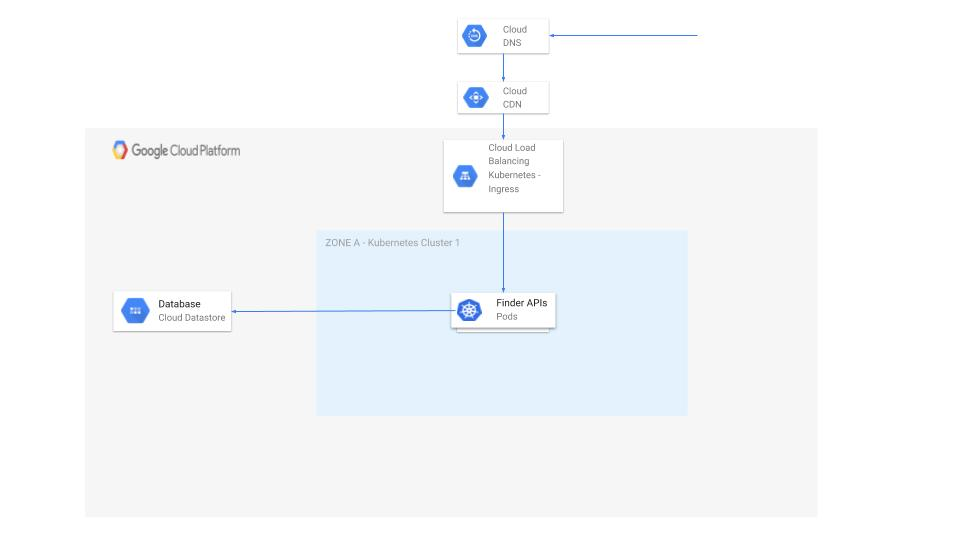
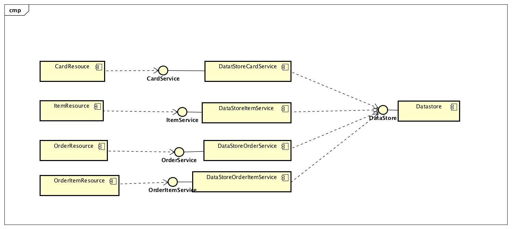

# su18-202-code-monkeys

### Setup

Prerequisites:

* Java 1.8 and above
* Maven 3
* gcloud sdk
* datastore emulator

If you own a Mac, the commands are simple:

```
brew install java
brew install maven
```

For windows, please download the installer and run the same.


Set up Gloud the instructions here need to be followed:

* [Mac](https://cloud.google.com/sdk/docs/quickstart-macos)
* [Windows](https://cloud.google.com/sdk/docs/quickstart-windows)


Once it is set up, install the data source emulator by following this [link](https://cloud.google.com/datastore/docs/tools/datastore-emulator)


Once it is installed, start up the emulator in a separate terminal using:

```
gcloud beta emulators datastore start
```

It will print out a command to run as follows:
* Mac
```
export DATASTORE_EMULATOR_HOST=localhost:8081
```
* Windows
```
set DATASTORE_EMULATOR_HOST=localhost:8081
```

Make sure to run it from the terminal where you are starting up the application.

### Building the appliation
From the root level of the application run:

```
mvn clean install
```

**NOTE: When changes are made to either bean or core, they need to be built again for the changes to be visible in the api**

### Run the application
To run the application:

```
cd starbucks-api
mvn clean spring-boot:run
```

### Verify the application
Open a browser and hit:

[http://localhost:8080/_ah/health](http://localhost:8080/_ah/health)


### Architecture



### Components


### Design considerations
The following were the design considerations taken while coming up with the structure of the project:

* The code was split out into API, Bean and Core modules.
 * Bean contains bean objects of all entities that are being persisted in the database.
 * Core contains business logic of how the datastore is supposed to be manipulated
 * API contains the resource files of the API specifications
* Each module contains only the minimal dependencies it requires to be built. Parent pom contains no dependencies.
* All manipulations of the datastore is only via interfaces meaning that all resource code can remain as is when a datastore is changed.
* APIs are versioned and breaking changes of the API would go into a newer version. This poses minimal impact to customers.
* All API resources have their own business logic interface. The person implementing a new API wouldnt have to modify any existing code to implement the new API. This ensured zero merge conflicts during development.

